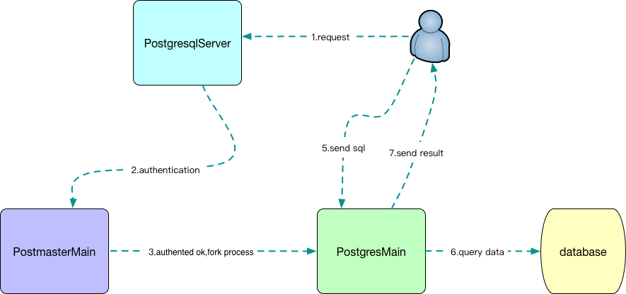

- postgresql源码编译和调试




- 安装依赖
  
```
yum install readline-devel zlib-devel gcc
```
- 编译和安装

```
//postgresql can't setting datadir during build
[postgres@CentOS7 postgresql-12.4]$ ./configure --prefix=/postgres/postgresql124 --enable-nls=zh_CN.UTF-8 --enable-debug 'CFLAGS=-O0 -g' --enable-thread-safety  --enable-profiling 
[postgres@CentOS7 postgresql-12.4]$make -j4 && make install
//数据库初始化
[postgres@CentOS7 ~]$ initdb  -D  /postgres/postgresql124/data 
//启动数据库
[postgres@CentOS7 postgresql-12.4] ./pg_ctl -D /postgres/postgresql124/data -l logfile start
 
```
- postgresql 进程
  
```
[postgres@CentOS7 postgresql-12.4] ps -ef|grep postgre
//postgresql主进程
postgres 164957      1  0 15:46 ?        00:00:00 /postgres/postgresql124/bin/postgres -D /postgres/postgresql124/data
//检查点进程，负责把日志信息刷到磁盘
postgres 164959 164957  0 15:46 ?        00:00:00 postgres: checkpointer
//后台写进程，负责把脏页刷到磁盘
postgres 164960 164957  0 15:46 ?        00:00:00 postgres: background writer   
//WAL日志写进程，负责把wal日志写到磁盘
postgres 164961 164957  0 15:46 ?        00:00:00 postgres: walwriter 
//无效（update/delete）数据清理进程  
postgres 164962 164957  0 15:46 ?        00:00:00 postgres: autovacuum launcher  
//统计信息收集进程 
postgres 164963 164957  0 15:46 ?        00:00:00 postgres: stats collector   
postgres 164964 164957  0 15:46 ?        00:00:00 postgres: logical replication launcher   
//用于处理用户请求的连接的进程
postgres 181209 164957  0 16:08 ?        00:00:00 postgres: postgres shop [local] idle
```
- postgresql 调试例子
```
//main postion:src/backend/main
[postgres@CentOS7 bin]$ gdb ./postgres  
(gdb) set args -p 8788  -D /postgres/postgresql103/data/
(gdb) br main  //core main
Breakpoint 1 at 0x6d804b: file main.c, line 62.
(gdb) br PostmasterMain  //entery main function
Breakpoint 2 at 0x791da3: file postmaster.c, line 579.
(gdb) br ServerLoop  //listen sock util client connected
Breakpoint 3 at 0x7935c3: file postmaster.c, line 1678.
(gdb) br ConnCreate //init a connection
Breakpoint 4 at 0x7949a7: file postmaster.c, line 2435.
(gdb) br BackendStartup //fork process for a conenction
Breakpoint 5 at 0x796f33: file postmaster.c, line 4018.
(gdb) br PostgresMain
Breakpoint 8 at 0x826b0d: file postgres.c, line 3587.
```


- 断点信息
```
(gdb) info break
Num     Type           Disp Enb Address            What
1       breakpoint     keep y   0x00000000006d804b in main at main.c:62
        breakpoint already hit 1 time
2       breakpoint     keep y   0x0000000000791da3 in PostmasterMain at postmaster.c:579
        breakpoint already hit 1 time
3       breakpoint     keep y   0x00000000007935c3 in ServerLoop at postmaster.c:1678
        breakpoint already hit 1 time
4       breakpoint     keep y   0x00000000007949a7 in ConnCreate at postmaster.c:2435
        breakpoint already hit 3 times
5       breakpoint     keep y   0x0000000000796f33 in BackendStartup at postmaster.c:4018
        breakpoint already hit 3 times
6       breakpoint     keep y   0x00000000007948eb in canAcceptConnections at postmaster.c:2377
        breakpoint already hit 5 times
7       breakpoint     keep y   0x00000000007886d1 in fork_process at fork_process.c:47
        breakpoint already hit 5 times
8       breakpoint     keep y   0x0000000000826b0d in PostgresMain at postgres.c:3587
```