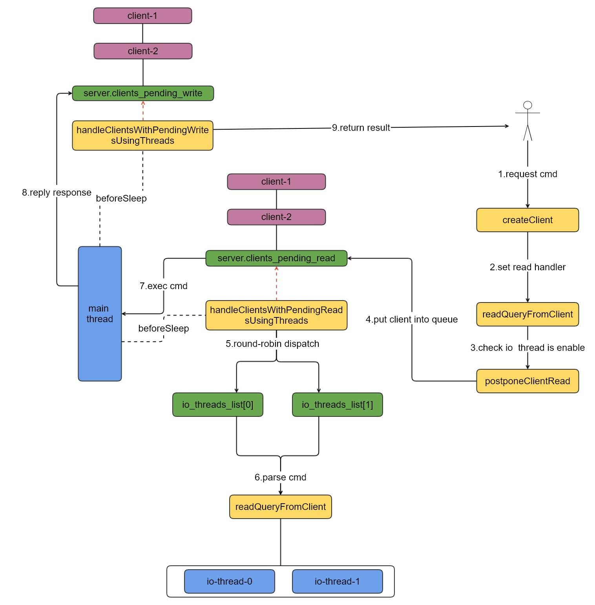

##  Redis6 强制多线程调试

| 作者 | 时间 |QQ技术交流群 |
| ------ | ------ |------ |
| perrynzhou@gmail.com |2020/12/01 |中国开源存储技术交流群(672152841) |

#### Redis 6 多线的限制

- 如果配置文件未开启多线程配置，则默认还是按照之前单线程模式进行运行整个redis-server
- 如果开启了多线程模式(在配置文件中配置io-threads 4和io-threads-do-reads yes),同时客户请求少于 2倍的IO线程数,也会按照单线程运行整个redis-server
- 多线程的开启和关闭相对比较智能，但是做不到启动开启多线程和关闭多线程，代码里面写死了禁用和启用多线程代码，其实这里可以添加一个command用户控制多线程在启动期间必须开启、关闭、自动。三种模式由用户自行选择，目前代码中写死的方式确实有些不恰当，也不知道基于什么考虑。

#### 简略架构图




#### Redis6 修改代码强制启动多线程(为调试)

```
// 代码逻辑在 networking.c,修改stopThreadedIOIfNeeded函数，取消请求数小于IO线程的2，函数直接返回0即可.将原来函数体用/**/注释掉，stopThreadedIOIfNeeded直接返回0
int stopThreadedIOIfNeeded(void) {
   /*
    int pending = listLength(server.clients_pending_write);
    if (server.io_threads_num == 1) return 1;
    if (pending < (server.io_threads_num*2)) {
        if (server.io_threads_active) stopThreadedIO();
        return 1;
    } else {
        return 0;
    }
    */
    
    return 0;
}
```


#### Redis 6多线程处理逻辑

- 主线程中的逻辑beforeSleep函数说明，这个是每次你都会执行，这里也潜在风险，因为是异步所以会有丢失数据的风险(因为在内存中，而非持久化到磁盘)
```
void beforeSleep(struct aeEventLoop *eventLoop) {
	// 异步处理读请求
    handleClientsWithPendingReadsUsingThreads();
    // 异步处理写请求
    handleClientsWithPendingWritesUsingThreads();
}
```

- IO多线程初始化，按照io-threads-do-reads配置来启动多个线程，redis6目前支持的最大线程数是128
```
#define IO_THREADS_MAX_NUM 128
void initThreadedIO(void) {
	for (int i = 0; i < server.io_threads_num; i++) {
        io_threads_list[i] = listCreate();
        if (i == 0) continue; /* Thread 0 is the main thread. */
        if (pthread_create(&tid,NULL,IOThreadMain,(void*)(long)i) != 0)         {
            serverLog(LL_WARNING,"Fatal: Can't initialize IO thread.");
            exit(1);
        }
        io_threads[i] = tid;
    }
}
```
- IO线程做的事情，根据IO_THREADS_OP_WRITE或者IO_THREADS_OP_READ来进行从客户端fd中读取输入并且解析命令或者写入结果给客户端操作
```
list *io_threads_list[IO_THREADS_MAX_NUM];

void *IOThreadMain(void *myid) {
	while(1) {
		listIter li;
        listNode *ln;
        listRewind(io_threads_list[id],&li);
        while((ln = listNext(&li))) {
            client *c = listNodeValue(ln);
            if (io_threads_op == IO_THREADS_OP_WRITE) {
               // 把影响结果会写给客户端
                writeToClient(c,0);
            } else if (io_threads_op == IO_THREADS_OP_READ) {
            	// 从客户端解析命令
                readQueryFromClient(c->conn);
            } else {
                serverPanic("io_threads_op value is unknown");
            }
        }
	}
}
```


- handleClientsWithPendingReadsUsingThreads处理请求处理


```
int handleClientsWithPendingReadsUsingThreads(void) {
	//判断IO线程是否开启，判断IO线程的将开启方式
    if (!server.io_threads_active || !server.io_threads_do_reads) return 0;
    // 当前全局的需要处理的读请求的队列长度
    int processed = listLength(server.clients_pending_read);
    if (processed == 0) return 0;

    if (tio_debug) printf("%d TOTAL READ pending clients\n", processed);

    /* Distribute the clients across N different lists. */
    listIter li;
    listNode *ln;
    listRewind(server.clients_pending_read,&li);
    int item_id = 0;
    
    //遍历所有的全局clients_pending_read列表
    while((ln = listNext(&li))) {
        client *c = listNodeValue(ln);
        //选择处理的线程，然后把对应的client放到不同线程的io_threads_list列表中
        int target_id = item_id % server.io_threads_num;
        listAddNodeTail(io_threads_list[target_id],c);
        item_id++;
    }

    /* Give the start condition to the waiting threads, by setting the
     * start condition atomic var. */
   
    // 设置已经放入线程队列的类型，是读操作写操作，这个时候由IOThreadMain函数来解析读写请求的命令
    io_threads_op = IO_THREADS_OP_READ;
    for (int j = 1; j < server.io_threads_num; j++) {
        int count = listLength(io_threads_list[j]);
        io_threads_pending[j] = count;
    }

    /* Also use the main thread to process a slice of clients. */
    //这里必须等待IOThreadMain函数把这一批次io_threads_list处理完毕，主线程也处理一些读请求
    listRewind(io_threads_list[0],&li);
    while((ln = listNext(&li))) {
        client *c = listNodeValue(ln);
        readQueryFromClient(c->conn);
    }
    listEmpty(io_threads_list[0]);

    /* Wait for all the other threads to end their work. */
    while(1) {
        unsigned long pending = 0;
        for (int j = 1; j < server.io_threads_num; j++)
            pending += io_threads_pending[j];
        if (pending == 0) break;
    }
    if (tio_debug) printf("I/O READ All threads finshed\n");

    //这里遍历所有server.clients_pending_read读请求列表，然后依次进行处理，这是显然是单线程操作,server.clients_pending_read是建立client时候就加入进来的
    while(listLength(server.clients_pending_read)) {
        ln = listFirst(server.clients_pending_read);
        client *c = listNodeValue(ln);
        c->flags &= ~CLIENT_PENDING_READ;
        listDelNode(server.clients_pending_read,ln);

        if (c->flags & CLIENT_PENDING_COMMAND) {
            c->flags &= ~CLIENT_PENDING_COMMAND;
            //processCommandAndResetClient函数是真正处理命令，kv写入到db的函数入口
            if (processCommandAndResetClient(c) == C_ERR) {
                /* If the client is no longer valid, we avoid
                 * processing the client later. So we just go
                 * to the next. */
                continue;
            }
        }
        processInputBuffer(c);
    }

    /* Update processed count on server */
    server.stat_io_reads_processed += processed;

    return processed;
}

```

- handleClientsWithPendingWritesUsingThreads处理请求结果写给客户端

```

int handleClientsWithPendingWritesUsingThreads(void) {
    int processed = listLength(server.clients_pending_write);
    if (processed == 0) return 0; /* Return ASAP if there are no clients. */

      //这里如果配置文件中配置IO线程为1,或者 客户端请求数<=当前IO线程的2倍则需要禁用停止多线程,stopThreadedIOIfNeeded来决定是否要开启多线程模式
    if (server.io_threads_num == 1 || stopThreadedIOIfNeeded()) {
        return handleClientsWithPendingWrites();
    }

    //如果配置了多线程,在这里server.io_threads_active=0，就会启动Redis多线程模式
    if (!server.io_threads_active) startThreadedIO();

    if (tio_debug) printf("%d TOTAL WRITE pending clients\n", processed);


    listIter li;
    listNode *ln;
    listRewind(server.clients_pending_write,&li);
    int item_id = 0;
    // 这里遍历所有的写命令操作的客户端请求，采用round-robin算法来把server.clients_pending_write全局请求摊到每个IO线程上去，分别执行响应的操作。server.clients_pending_write这队列是每个请求经过processCommandAndResetClient函数把kv写入db后，然后调用addReply或者addReply{XXX}函数把这些client再次放到server.clients_pending_write队列中。
    while((ln = listNext(&li))) {
        client *c = listNodeValue(ln);
        c->flags &= ~CLIENT_PENDING_WRITE;

        /* Remove clients from the list of pending writes since
         * they are going to be closed ASAP. */
        if (c->flags & CLIENT_CLOSE_ASAP) {
            listDelNode(server.clients_pending_write, ln);
            continue;
        }

        int target_id = item_id % server.io_threads_num;
        listAddNodeTail(io_threads_list[target_id],c);
        item_id++;
    }

   //这里在设置IO线程中处理请求的类型是IO_THREADS_OP_WRITE
    io_threads_op = IO_THREADS_OP_WRITE;
    for (int j = 1; j < server.io_threads_num; j++) {
        int count = listLength(io_threads_list[j]);
        io_threads_pending[j] = count;
    }

    // 这里必须等待IOThreadMain函数把这一批次io_threads_list处理完毕，主线程也处理一些写请求
    listRewind(io_threads_list[0],&li);
    while((ln = listNext(&li))) {
        client *c = listNodeValue(ln);
        writeToClient(c,0);
    }
    listEmpty(io_threads_list[0]);

    /* Wait for all the other threads to end their work. */
    while(1) {
        unsigned long pending = 0;
        for (int j = 1; j < server.io_threads_num; j++)
            pending += io_threads_pending[j];
        if (pending == 0) break;
    }
    if (tio_debug) printf("I/O WRITE All threads finshed\n");

    // 遍历全局的IO_THREADS_OP_WRITE类型client列表clients_pending_write，在主线程中依次进行处理
    listRewind(server.clients_pending_write,&li);
    while((ln = listNext(&li))) {
        client *c = listNodeValue(ln);

        /* Install the write handler if there are pending writes in some
         * of the clients. */
        if (clientHasPendingReplies(c) &&
                connSetWriteHandler(c->conn, sendReplyToClient) == AE_ERR)
        {
            freeClientAsync(c);
        }
    }
    listEmpty(server.clients_pending_write);

    /* Update processed count on server */
    server.stat_io_writes_processed += processed;

    return processed;
}

```

- 是否开启IO线程的判断函数stopThreadedIOIfNeeded
```
 // 如果server.io_threads_num==1则表示只有一个IO线程
 int stopThreadedIOIfNeeded(void) {
    int pending = listLength(server.clients_pending_write);

    /* Return ASAP if IO threads are disabled (single threaded mode). */
    if (server.io_threads_num == 1) return 1;
    // 当前请求数如果小于IO线程的2倍，则停止IO线程，设置server.io_threads_active=0，表示禁用多线程
    if (pending < (server.io_threads_num*2)) {
        if (server.io_threads_active) stopThreadedIO();
        return 1;
    } else {
        return 0;
    }
}
```

- readQueryFromClient负责从客户端读取命令并且进行解析，这个算是一个
```
void readQueryFromClient(connection *conn) {
   client *c = connGetPrivateData(conn);
    int nread, readlen;
    size_t qblen;

    //如果开启多线程，需要把client放到server.clients_pending_read队列中
    if (postponeClientRead(c)) return;
    /****************忽略其他*************/
     processInputBuffer(c);
}
int postponeClientRead(client *c) {
    if (server.io_threads_active &&
        server.io_threads_do_reads &&
        !ProcessingEventsWhileBlocked &&
        !(c->flags & (CLIENT_MASTER|CLIENT_SLAVE|CLIENT_PENDING_READ)))
    {
        c->flags |= CLIENT_PENDING_READ;
        listAddNodeHead(server.clients_pending_read,c);
        return 1;
    } else {
        return 0;
    }
}
```


