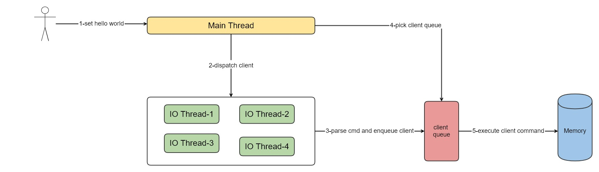
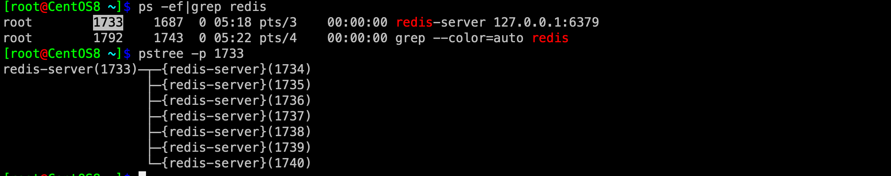
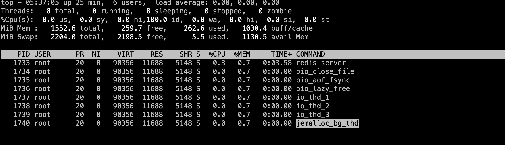

## redis 6多线程模型

| 作者 | 时间 |QQ技术交流群 |
| ------ | ------ |------ |
| perrynzhou@gmail.com | 2020/11/01 |中国开源存储技术交流群(672152841) |
### redis 多线程架构


 


- redis6之前的版本一直单线程方式解析命令、处理命令，这样的模式实现起来简单，但是无法使用多核CPU的优势，无法达到性能的极致；到了redis 6，redis6采用多线程模式来来读取和解析命令，但是命令的执行依然通过队列由主线程串行执行，多线程的好处是分离了命令的解析和命令执行，命令的解析有独立的IO线程进行，命令执行依旧有main线程执行,多线程增加了代码的复杂度
### 开启多线程模型

- Redis.conf添加如下配置
  ```
  io-threads 4
  io-threads-do-reads yes
  ```
  - 在redis-server中的该配置表现为三个字段
  ```
  struct redisServer {
    pthread_t main_thread_id;         /* Main thread id */
    int io_threads_num;         /* Number of IO threads to use. */
    int io_threads_do_reads;    /* Read and parse from IO threads? */
    int io_threads_active;      /* Is IO threads currently active? */
  }
  ```
- 启动redis并查看多线程
    
    
    - redis-server thread:从队列中取出数据一次执行命令
    - bio_aof_fsync thread :page cache中的aof数据fsync到磁盘的线程
    - io_thd thread: 从tcp中读取命令同时解析命令


- 多线程主逻辑
```
int main(int argc, char **argv) {
    // 加载配置文件
    loadServerConfig(configfile,options);
    //主线程逻辑初始化，启动aeCreateFileEvent/beforeSleep.
    initServer() {
    	void beforeSleep(struct aeEventLoop *eventLoop) {
	 		handleClientsWithPendingReadsUsingThreads() {
	 			readQueryFromClient->processInputBuffer->processCommandAndResetClient->processCommand->call
	 		}
		}
    }
    //多线程模型初始化
    InitServerLast();
    aeMain(server.el);
}


void InitServerLast() {
    initThreadedIO();
    set_jemalloc_bg_thread(server.jemalloc_bg_thread);
    server.initial_memory_usage = zmalloc_used_memory();
}

void initThreadedIO(void) {
     for (int i = 0; i < server.io_threads_num; i++) {
         pthread_create(&tid,NULL,IOThreadMain,(void*)(long)i);
     }
}
void *IOThreadMain(void *myid) {
	while(1) {
		 listIter li;
        listNode *ln;
        listRewind(io_threads_list[id],&li);
        while((ln = listNext(&li))) {
        	//这里解析命令同时放到client放到 server.clients_pending_read队列中
        	readQueryFromClient(c->conn);
        }
	}
}
```

```

// conn->type->xxx 对应的函数
ConnectionType CT_Socket = {
    .ae_handler = connSocketEventHandler,
    .close = connSocketClose,
    .write = connSocketWrite,
    .read = connSocketRead,
    .accept = connSocketAccept,
    .connect = connSocketConnect,
    .set_write_handler = connSocketSetWriteHandler,
    .set_read_handler = connSocketSetReadHandler,
    .get_last_error = connSocketGetLastError,
    .blocking_connect = connSocketBlockingConnect,
    .sync_write = connSocketSyncWrite,
    .sync_read = connSocketSyncRead,
    .sync_readline = connSocketSyncReadLine,
    .get_type = connSocketGetType
};
```

```
int processCommand(client *c) {
	
	call(c,CMD_CALL_FULL);
}
int processCommandAndResetClient(client *c) {
	processCommand(c)
}
int handleClientsWithPendingReadsUsingThreads(void) {
	while(listLength(server.clients_pending_read)) {
        ln = listFirst(server.clients_pending_read);
        client *c = listNodeValue(ln);
        c->flags &= ~CLIENT_PENDING_READ;
        listDelNode(server.clients_pending_read,ln);
        processCommandAndResetClient(c) == C_ERR)
        processInputBuffer(c);
    }
}
void beforeSleep(struct aeEventLoop *eventLoop) {
   handleClientsWithPendingReadsUsingThreads();
}
int postponeClientRead(client *c) {
    if (server.io_threads_active &&
        server.io_threads_do_reads &&
        !ProcessingEventsWhileBlocked &&
        !(c->flags & (CLIENT_MASTER|CLIENT_SLAVE|CLIENT_PENDING_READ)))
    {
        c->flags |= CLIENT_PENDING_READ;
        listAddNodeHead(server.clients_pending_read,c);
        return 1;
    } else {
        return 0;
    }
}

void readQueryFromClient(connection *conn) {
	 /* Check if we want to read from the client later when exiting from
     * the event loop. This is the case if threaded I/O is enabled. */
    if (postponeClientRead(c)) return;
}
//一个客户端计入流程
client *createClient(connection *conn) {
    client *c = zmalloc(sizeof(client));
    connSetReadHandler(conn, readQueryFromClient);
        //初始化client其他的信息
}
void acceptTcpHandler(aeEventLoop *el, int fd, void *privdata, int mask) {
        acceptCommonHandler(connCreateAcceptedSocket(cfd),0,cip);
}
static void acceptCommonHandler(connection *conn, int flags, char *ip) {
   createClient(conn);
}
/* Register a read handler, to be called when the connection is readable.
 * If NULL, the existing handler is removed.
 */
static int connSocketSetReadHandler(connection *conn, ConnectionCallbackFunc func) {
    if (func == conn->read_handler) return C_OK;

    conn->read_handler = func;
    if (!conn->read_handler)
        aeDeleteFileEvent(server.el,conn->fd,AE_READABLE);
    else
        if (aeCreateFileEvent(server.el,conn->fd,
                    AE_READABLE,conn->type->ae_handler,conn) == AE_ERR) return C_ERR;
    return C_OK;
}

static void connSocketEventHandler(struct aeEventLoop *el, int fd, void *clientData, int mask)
{
    //conn->conn_handler = clientAcceptHandler
    if (!callHandler(conn, conn->conn_handler)) return;
 /* Handle normal I/O flows */
    if (!invert && call_read) {
        if (!callHandler(conn, conn->read_handler)) return;
    }
    /* Fire the writable event. */
    if (call_write) {
        if (!callHandler(conn, conn->write_handler)) return;
    }
    /* If we have to invert the call, fire the readable event now
     * after the writable one. */
    if (invert && call_read) {
        if (!callHandler(conn, conn->read_handler)) return;
    }
}
```
