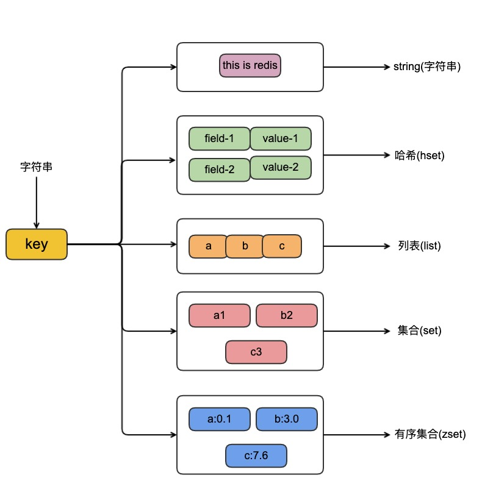
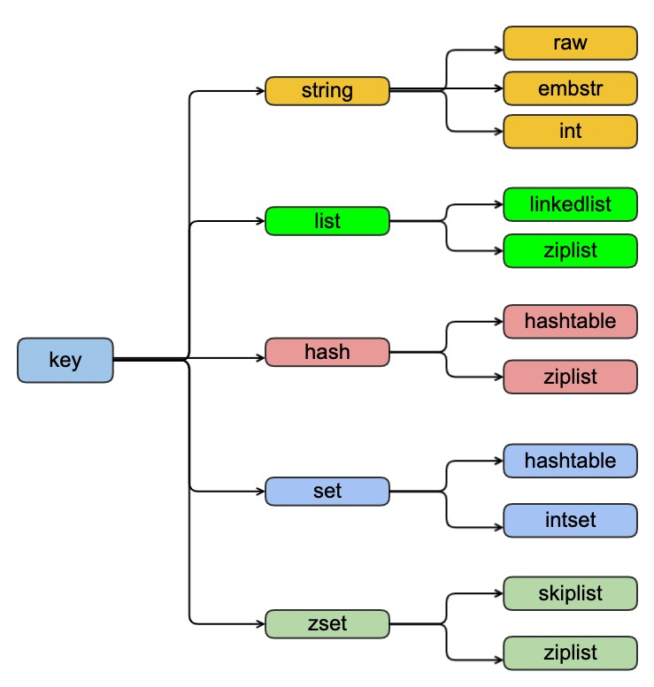

## redis的支持几种数据结构和编码方式

| 作者 | 时间 |QQ技术交流群 |
| ------ | ------ |------ |
| perrynzhou@gmail.com |2020/07/08 |中国开源存储技术交流群(672152841) |


### redis支持的的数据类型有哪几种?

  
  
- redis支持的数据结构有字符串、列表、哈希、集合、有序集合，这些是redis 对外提供的数据结构
- 每种数据结构都有自己的底层的内部编码实现，比如list包含了linkedlist和ziplist编码编码实现

### redis中的值是怎么表示的?怎么和数据结构对应起来？

  

- redisObject是redis中的value的具体实现，具体结构定义如下：
    ```
    typedef struct redisObject {
        //redis实现的值的数据类型，包括字符串、列表、哈希、集合
        unsigned type:4;
        //这些redis支持这些类型的具体实现方式
        unsigned encoding:4;
        //表示对象空转时间，用于限制内存下长久不访问的对象清理
        unsigned lru:LRU_BITS; 
        //应用计数用于对象的回收
        int refcount;
        //这个值的具体的实现数据结构的地址
        void *ptr;
    } robj;
    ```

