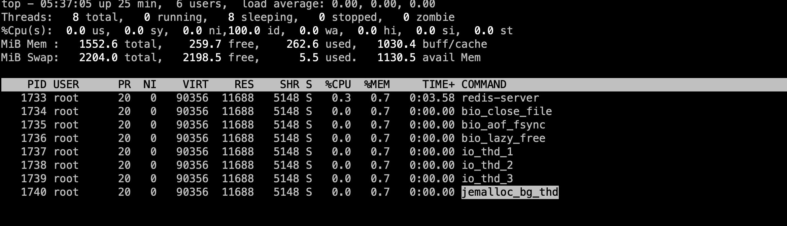

## redis 6多线程模型


### 开启多线程模型

- Redis.conf添加如下配置

  ```
  io-threads 4
  io-threads-do-reads yes
  ```
  - 在redis-server中的该配置表现为三个字段
  ```
  struct redisServer {
    pthread_t main_thread_id;         /* Main thread id */
    int io_threads_num;         /* Number of IO threads to use. */
    int io_threads_do_reads;    /* Read and parse from IO threads? */
    int io_threads_active;      /* Is IO threads currently active? */
  }
  ```
- 启动redis并查看多线程
    
    
    - redis-server主线程
    - bio_close_file线程
    - bio_aof_fsync线程
    - io_thd线程
    - jemalloc_bg_thd线程


- 多线程主逻辑
```
int main(int argc, char **argv) {
    // 加载配置文件
    loadServerConfig(configfile,options);
    //主线程逻辑初始化
    initServer();
    //多线程模型初始化
    InitServerLast();
}

void InitServerLast() {
    bioInit();
    initThreadedIO();
    set_jemalloc_bg_thread(server.jemalloc_bg_thread);
    server.initial_memory_usage = zmalloc_used_memory();
}
/* Initialize the background system, spawning the thread. */
void bioInit(void) {
     //BIO_NUM_OPS 硬编码为3
     for (j = 0; j < BIO_NUM_OPS; j++) {
            pthread_create(&thread,&attr,bioProcessBackgroundJobs,arg)
        }
    }
}
void initThreadedIO(void) {
     for (int i = 0; i < server.io_threads_num; i++) {
         pthread_create(&tid,NULL,IOThreadMain,(void*)(long)i);
     }
}
```

```

// conn->type->xxx 对应的函数
ConnectionType CT_Socket = {
    .ae_handler = connSocketEventHandler,
    .close = connSocketClose,
    .write = connSocketWrite,
    .read = connSocketRead,
    .accept = connSocketAccept,
    .connect = connSocketConnect,
    .set_write_handler = connSocketSetWriteHandler,
    .set_read_handler = connSocketSetReadHandler,
    .get_last_error = connSocketGetLastError,
    .blocking_connect = connSocketBlockingConnect,
    .sync_write = connSocketSyncWrite,
    .sync_read = connSocketSyncRead,
    .sync_readline = connSocketSyncReadLine,
    .get_type = connSocketGetType
};
```

```
//一个客户端计入流程
client *createClient(connection *conn) {
    client *c = zmalloc(sizeof(client));
    connSetReadHandler(conn, readQueryFromClient);
        //初始化client其他的信息
}
void acceptTcpHandler(aeEventLoop *el, int fd, void *privdata, int mask) {
        acceptCommonHandler(connCreateAcceptedSocket(cfd),0,cip);
}
static void acceptCommonHandler(connection *conn, int flags, char *ip) {
   createClient(conn);
}
/* Register a read handler, to be called when the connection is readable.
 * If NULL, the existing handler is removed.
 */
static int connSocketSetReadHandler(connection *conn, ConnectionCallbackFunc func) {
    if (func == conn->read_handler) return C_OK;

    conn->read_handler = func;
    if (!conn->read_handler)
        aeDeleteFileEvent(server.el,conn->fd,AE_READABLE);
    else
        if (aeCreateFileEvent(server.el,conn->fd,
                    AE_READABLE,conn->type->ae_handler,conn) == AE_ERR) return C_ERR;
    return C_OK;
}

static void connSocketEventHandler(struct aeEventLoop *el, int fd, void *clientData, int mask)
{
    //conn->conn_handler = clientAcceptHandler
    if (!callHandler(conn, conn->conn_handler)) return;
 /* Handle normal I/O flows */
    if (!invert && call_read) {
        if (!callHandler(conn, conn->read_handler)) return;
    }
    /* Fire the writable event. */
    if (call_write) {
        if (!callHandler(conn, conn->write_handler)) return;
    }
    /* If we have to invert the call, fire the readable event now
     * after the writable one. */
    if (invert && call_read) {
        if (!callHandler(conn, conn->read_handler)) return;
    }
}
```