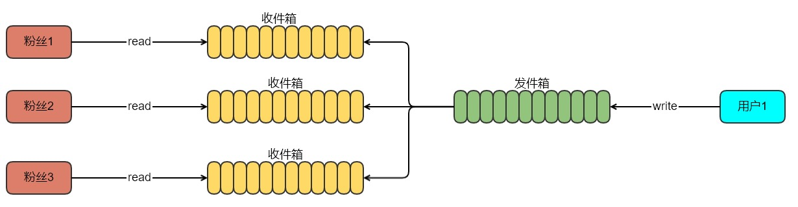

## 缓存中的高并发问题

| author | update |
| ------ | ------ |
| perrynzhou@gmail.com | 2020/10/12 |

### 高并发解决之道

#### 高并发读

##### 提供缓存系统
- 增加本地缓存或者memcached/redis集中式缓存,添加集中式缓存过程中需要注意如下问题

  - 缓存雪崩,这个也是缓存系统高可用问题，如果缓存宕机了，会导致所有的请求全部请求到后端的mysql/postgresql数据库，这样会把数据库系统压垮。

  - 缓存穿透，这个是缓存系统没有宕机，但是某些key发生大量查询时候，key不在缓存系统中，这会导致短时间内大量请求打到后端数据库mysql/postgresql中，压垮数据库

  - 大量的热key过期,因为某些热key大量过期导致请求打到后端数据库中，对后端数据库造成一定的压力

- CDN加速静态文件
  - 静态内容,数据不变，对于用户请求来说，数据基本是一致的，比如图片、js、css文件、直播系统中的视屏内容

  - 动态内容,根据用户请求或者其他动态生成内容并返回给用户

  - 对于静态内容,最常用的处理策略是CDN，将静态文件缓存在CDN的所有节点,用户第一次请求时候，查询离用户最近的节点，如果该节点没有数据，则CDN就去获取数据缓存到该节点，后续请求按照就近的原则，如果选择的是这个节点，直接从该节点获取数据即可 

##### 并发读
- 异步RPC,现在RPC都支持异步RPC，针对用户请求，如果需要调用3个RPC接口(3个接口没有耦合)，耗时分别是t1、t2、t3.如果是同步调用，则所消耗的时间总和为T=t1+t2+t3.如果是异步调用,所需的时间为T=max(t1,t2,t3).

##### 读写策略变更
- 假设发朋友圈和查看朋友圈的场景，对于两端操作都需要操作，如果访问的频率非常高，查询数据库的方式是无法满足高并发的情况，有一种方法可以解决，就是采用邮箱系统的模式，每个发朋友圈的用户设置一个发件箱，关注这个用户的粉丝设置一个收件箱，如果用户发了一条信息到朋友圈，只需要把这条信息写到自己的发件箱，然后采用后端process/thread异步的刷新到关注这个用户粉丝的收件箱即可.每个收件箱和发件箱设置最大信息数。
  

#### 高并发写

##### 数据分片
- 用户请求的数据或者请求分成多份并行处理，比如数据库的分库分表、es的分布式索引
##### 任务分片
- 用户请求的任务进行分片，这个问题也是计算中分而治之的方法
##### 异步化
- 用户请求处理的异步化，可以从几个层面解决，比如从linux、接口层面、业务层面。http1.1的异步化和http2的二进制分帧都是异步的例子，客户端发送一个http请求后不等待结果返回,立即发送第2个、第3个；数据库中的内存事务提交与wal也是按照这个套路来做
  - LSM树是典型的异步写的思想。LSM树支撑是KV存储系统,插入时候是无序的，但是在磁盘上存储是按照K的代销顺序存储的，也就是说实现了磁盘上的ordered hash map.首选，磁盘写入速度非常慢，所以不从磁盘写数据，而是在内存中维护一个order hash map,这样写性能就高了；但是数据在内存中，一旦掉电数据就全部丢失了，于是需要添加一个wal的日志，日志是按照append的写的方式，所以都是顺序写。所以有了wal日志和内存中的order hash map,在加上一个后台进程定期把内存中的order hash map合并到磁盘中。基于LSM存储系统的设计基本是 内存中的order hash map + wal日志+ 后台process。当客户端put一个kv时候，实际的操作就是新增一条Wal日志，同时在kv插入到内存的order hash map中
##### 批量
- 针对用户的请求尽量采用打包批量请求，这样能提高效率
